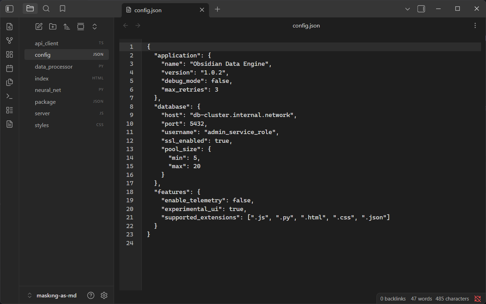
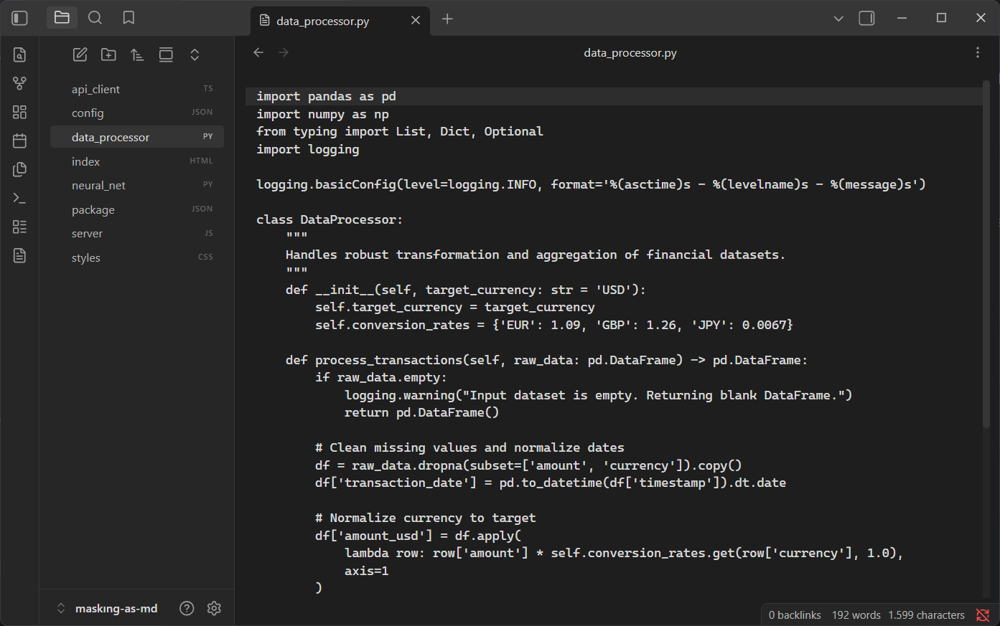
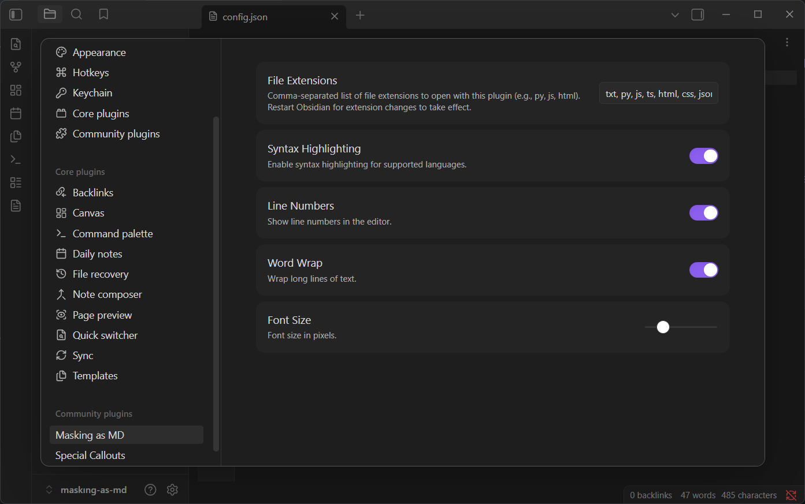

  
  
  
  
  
  
  

  <a href="README_TR.md">Türkçe</a> · <a href="https://github.com/ahseyg/Masking-as-MD/issues">Report Bug</a>

# Masking as MD for Obsidian

Transform Obsidian into a powerful code editor for your non-markdown files. This plugin allows you to open, view, and edit files like `.py`, `.js`, `.html`, `.css`, and `.json` natively within your vault, complete with syntax highlighting and line numbers. 

**Open source** · MIT License · Contributions welcome

---

## Features

- **Native Code Editor Experience** — turn Obsidian into a lightweight IDE for your scripts and config files
- **Syntax Highlighting** — built-in CodeMirror support for popular programming and markup languages
- **Customizable Interface** — toggle syntax highlighting, line numbers, and word wrap
- **Typography Control** — adjust the editor font size to your liking
- **Seamless Integration** — supported files open just like standard Markdown files, or right-click any file to "Open as Text"

---

## Screenshots

### Settings

---

## Why Masking as MD?

Obsidian is excellent for Markdown, but occasionally you need to edit scripts, configuration files, or web documents without leaving your vault. Instead of relying on external editors, Masking as MD integrates a fully-fledged CodeMirror 6 editor directly into Obsidian.

Files are opened securely as plain text. No conversions to Markdown occur, and your files are never modified unless you manually edit and save them.

---

## Supported Languages

The plugin provides built-in syntax highlighting for the following languages out of the box:
- **JavaScript / TypeScript** (`.js`, `.jsx`, `.ts`, `.tsx`)
- **Python** (`.py`)
- **HTML** (`.html`, `.htm`)
- **CSS / SCSS / LESS** (`.css`, `.scss`, `.less`)
- **JSON** (`.json`)
- **YAML** (`.yaml`, `.yml`)
- **Markdown** (`.md`, `.markdown` - if forced to open with this plugin)

---

## Configuration Reference

Navigate to **Settings → Masking as MD** to configure the plugin:

| Setting | Description |
| :--- | :--- |
| **File Extensions** | Comma-separated list of extensions to handle (e.g. `py, js, html, css, txt`). *Requires restart.* |
| **Syntax Highlighting** | Enable or disable CodeMirror syntax highlighting. |
| **Line Numbers** | Display line numbers on the left side of the editor. |
| **Word Wrap** | Wrap long lines of code to avoid horizontal scrolling. |
| **Font Size** | Set your preferred editor font size using the slider. |

---

## Installation

### Community Plugins (Recommended)

1. **Settings → Community Plugins**
2. Turn off Restricted Mode
3. Browse → search **Masking as MD**
4. Install → Enable

Or open directly: [community.obsidian.md/plugins/masking-as-md](https://community.obsidian.md/plugins/masking-as-md)

### Manual

1. Download `main.js`, `manifest.json`, `styles.css` from the [latest release](https://github.com/ahseyg/Masking-as-MD/releases)
2. Create `VaultFolder/.obsidian/plugins/masking-as-md/`
3. Copy the files into the folder
4. Enable in Settings → Community Plugins

---

## Contributing

- **Bug reports:** [Open an issue](https://github.com/ahseyg/Masking-as-MD/issues)
- **Feature requests:** [Open an issue](https://github.com/ahseyg/Masking-as-MD/issues)
- **Pull requests:** Fork → Branch → Code → PR

If you find this plugin useful, consider giving it a [star](https://github.com/ahseyg/Masking-as-MD).

---

## Development

If you wish to build the plugin from source:

1. Clone this repository.
2. Run `npm install` to install dependencies.
3. Run `npm run build` to compile the plugin.
4. Copy the output files to your Obsidian vault's plugin folder.

---

## License

MIT — See [LICENSE](LICENSE) for details.

---

  Developed by <a href="https://github.com/ahseyg">ahseyg</a>

